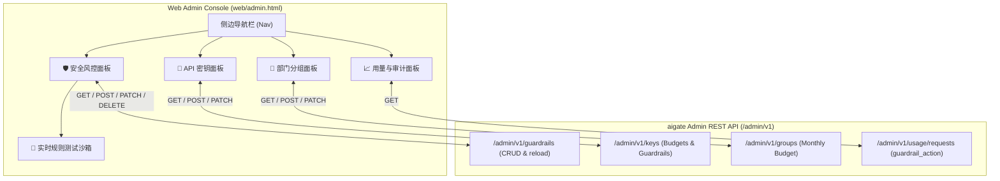

# Admin 控制台安全风控管理与月度预算可视化设计规范

日期：2026-09-26 · 模块：Web 控制台 (`web/admin.html`) · 状态：设计完成待实现

---

## 1. 背景与目标

### 1.1 背景
在上一阶段，aigate 核心引擎与 Admin REST API 已全面支持安全防护与脱敏风控体系：
1. **多模式关键词阻断**：基于 Aho-Corasick 算法的敏感词过滤。
2. **入站 PII 隐私脱敏**：基于 POSIX 正则的手机号、身份证、邮箱、API Key 结构化脱敏。
3. **双层月度预算硬限额**：Key 级别月度费用与 Token 预算，以及 Group 部门级别月度费用限额（HTTP 429 阻断）。
4. **审计日志记账**：`usage_requests` 每请求审计日志记录 `guardrail_action` (`''` / `'masked'` / `'blocked'`)。
5. **管理平面 REST API**：已提供 `/admin/v1/guardrails` 完整 CRUD 与热重载接口，并在 Key / Group API 中支持预算与风控开关。

### 1.2 目标
当前嵌入式 Web 控制台 (`web/admin.html`) 尚未将上述能力进行图形化展示与运维交互。本次优化的目标是：
- 在控制台提供独立的 **🛡️ 安全风控规则管理** 专区，支持规则 CRUD、即时启用/禁用开关、一键预置常用 PII 规则以及**实时测试沙箱**。
- 在 **API 密钥** 与 **部门分组** 管理中内嵌月度预算配置与风控启用开关。
- 在 **请求审计明细** 中增加风控处置动作的彩色徽章展示与多维筛选。
- 保持单文件内嵌形态，零外部前端框架依赖，适配桌面端与移动端。

---

## 2. 总体架构与交互流



---

## 3. 详细功能模块设计

### 3.1 侧边栏导航扩展 (`nav`)
在侧边栏新增「安全与合规」分类：
```html
<div class="side-section-title pt-3">安全与合规</div>
<button data-tab="guardrails" onclick="switchTab('guardrails')" class="side-link">
  <span class="text-base">🛡️</span>
  <span>安全风控</span>
</button>
```
移动端抽屉导航同步加入该入口。

---

### 3.2 🛡️ 安全风控规则管理面板 (`tab-guardrails`)

#### 3.2.1 统计指标卡 (Metrics Cards)
顶部展示 4 个核心指标卡：
1. **有效规则总数**：当前启用的规则总数。
2. **敏感词拦截 (Block)**：阻断型规则计数。
3. **隐私脱敏 (Mask)**：脱敏型规则计数。
4. **引擎同步状态**：显示“已同步”绿标；当发生本地编辑或需要重载时支持一键重载。

#### 3.2.2 🧪 实时规则测试沙箱 (Rule Sandbox)
位于面板上方，供管理员在不发起真实请求的前提下快速验证规则匹配逻辑：
- **输入框**：提供多行或单行测试文本输入框（如：“联系电话 13812345678，请勿 DROP TABLE”）。
- **执行按钮**：“执行匹配测试”。
- **匹配结果区**：
  - 若命中敏感词阻断：红色告警条显示 `🛑 判定结果：拦截 (Blocked) · 命中违禁词: [DROP TABLE] (规则 #1)`。
  - 若命中隐私脱敏：琥珀色高亮条显示 `🛡️ 判定结果：脱敏 (Masked) · 脱敏后文本预览: 联系电话 [PHONE]...`。
  - 若完全放行：绿色提示条显示 `✅ 判定结果：通过 (Pass) · 未命中任何风控规则`。

#### 3.2.3 快捷预置与过滤操作栏
- **一键预置常用 PII 规则按钮**：点击弹出确认，自动调用创建接口预填充常见规则：
  - 手机号脱敏：`rule_type: "pii"`, `pattern: "[PHONE]"`, `action: "mask"`, `category: "privacy"`
  - 身份证脱敏：`rule_type: "pii"`, `pattern: "[ID_CARD]"`, `action: "mask"`, `category: "privacy"`
  - 邮箱脱敏：`rule_type: "pii"`, `pattern: "[EMAIL]"`, `action: "mask"`, `category: "privacy"`
  - API Key 脱敏：`rule_type: "pii"`, `pattern: "[API_KEY]"`, `action: "mask"`, `category: "security"`
- **类型过滤下拉框**：全部类型 / 敏感词 (keyword) / 隐私 (pii) / 正则 (regex)。
- **新建规则按钮**：打开新建弹窗。
- **热重载引擎按钮**：调用 `POST /admin/v1/guardrails/reload`，成功后弹出气泡提示。

#### 3.2.4 规则列表数据表格
表格字段：
| 字段 | 说明 | 呈现形式 |
|---|---|---|
| ID | 规则唯一标识 | 数字 `#12` |
| 类型 | keyword / pii / regex | 彩色 Badge（蓝/紫/青） |
| 匹配模式 (Pattern) | 敏感词文本或脱敏模式 | 等宽字体 `code` 标签 |
| 处置动作 | block / mask | `🛑 阻断拦截` (红) / `🛡️ 就地脱敏` (黄) |
| 分类标签 | category | 灰色小标签 (如 `safety`, `privacy`) |
| 启用状态 | enabled | 切换开关 (Toggle Switch)，点击即时 PATCH 切换状态 |
| 操作 | 编辑 / 删除 | 快捷操作链接，删除时二次确认弹窗 |

#### 3.2.5 新建/编辑规则弹窗 (Modal)
表单字段：
- **规则类型**：单选或下拉（敏感词 `keyword` / 隐私合规 `pii` / 正则表达式 `regex`）。
- **匹配模式 (Pattern)**：文本框，必填，最大 511 字符。
- **处置动作 (Action)**：单选框（阻断拦截 `block` / 就地脱敏 `mask`）。
- **分类标签 (Category)**：输入框（默认 `general`）。
- **启用开关**：勾选框（默认启用）。

---

### 3.3 🔑 API 密钥面板增强 (`tab-keys`)

1. **表格列扩展**：
   - **月度费用预算**：展示如 `$20.00 / 月`，若为 `0` 则展示 `无限制`。
   - **月度 Token 预算**：展示如 `500,000 / 月`，若为 `0` 则展示 `无限制`。
   - **安全风控状态**：展示 `🛡️ 启用` (绿标) 或 `✕ 禁用` (灰标)。
2. **新建/编辑密钥弹窗扩展**：
   - 增加输入项：`月度费用预算 (USD)`（数值，默认 0.0）。
   - 增加输入项：`月度 Token 预算 (Tokens)`（整数，默认 0）。
   - 增加勾选框：`启用安全风控与脱敏 (Guardrails)`（默认选中）。
   - 提交创建时写入参数，编辑时提交对应 PATCH mask。

---

### 3.4 👥 部门分组面板增强 (`tab-groups`)

1. **表格列扩展**：
   - **月度费用硬限额**：展示如 `$100.00 / 月`，若为 `0` 则展示 `无限制`。
2. **新建/编辑分组弹窗扩展**：
   - 增加输入项：`月度费用硬限额 (USD)`（数值，默认 0.0）。
   - 提示说明：“当分组内所有密钥当月累计消费达到该限额时，网关将阻断后续调用并返回 HTTP 429 budget_exceeded”。

---

### 3.5 📈 请求明细与审计日志增强 (`tab-usage` / `tab-requests`)

1. **审计明细表格新增列**：
   - 列名：`风控处置`
   - 显示：
     - 若 `guardrail_action == "blocked"`：展示红底 Badge `🛑 拦截`。
     - 若 `guardrail_action == "masked"`：展示黄底 Badge `🛡️ 脱敏`。
     - 若为空或正常：展示灰色文本 `正常透传`。
2. **顶部筛选栏扩展**：
   - 增加下拉选项：`风控处置: 全部 / 仅拦截 (blocked) / 仅脱敏 (masked) / 正常透传`，前端实时筛选表格行。

---

## 4. 技术实现细节与兼容性

### 4.1 编译与打包流水线
- 静态页面源文件：`web/admin.html`
- 打包脚本：`scripts/html_to_c.py`
  - 自动将 `web/admin.html` 转换为 C 语言原生头文件 `src/admin_ui_html.h`（包含压缩字节数组 `ADMIN_UI_HTML` 与长度 `ADMIN_UI_HTML_LEN`）。
- 编译链路：CMake 构建目标 `generate_admin_ui_html` 自动监听 `web/admin.html` 的修改并在编译时重新生成头文件，无需手动干预。

### 4.2 前端代码架构
- **样式规范**：沿用已有的 Tailwind Utility 规则与 CSS 变量系统（如 `--bg-app`, `--card-bg`, `--border-color`），确保深色模式与浅色模式视觉统一。
- **状态管理**：
  - `g_guardrail_rules`: 缓存规则列表。
  - `renderGuardrails()`: 渲染规则表格与指标。
  - `testGuardrailsSandbox()`: 执行沙箱测试逻辑。
  - `reloadGuardrailsEngine()`: 触发后端引擎热加载。
  - `seedDefaultPiiRules()`: 一键批量注册常用 PII 规则。
- **网络通信**：
  - 复用现有 `adminFetch(endpoint, options)` 函数，自动携带 Bearer Token 并统一处理 401/429/500 错误提示。

---

## 5. 测试与验证策略

1. **编译构建验证**：
   - 修改 `web/admin.html` 后执行 `cmake --build .build -j$(nproc)`，确保静态资源代码生成无误且 C17 编译通过。
2. **端到端集成测试 (`tests/integration/test_gateway.py`)**：
   - 更新或新增 `test_admin_ui_guardrails_tab`：请求 `GET /admin`，验证返回的 HTML 中包含 `data-tab="guardrails"`、风控规则表格容器及相关配置字段。
3. **浏览器可视化验证**：
   - 通过浏览器直接访问网关 Admin UI，验证：
     - 切换到「🛡️ 安全风控」标签，查看规则列表、指标卡。
     - 点击「+ 新建规则」，创建一条测试敏感词规则。
     - 在沙箱中输入测试文本，点击测试，验证判定结果正确。
     - 切换到「API 密钥」，验证预算列与风控状态显示正确。
     - 切换到「部门分组」，验证月度限额显示正确。
     - 切换到「请求日志」，验证风控标签与过滤有效。
