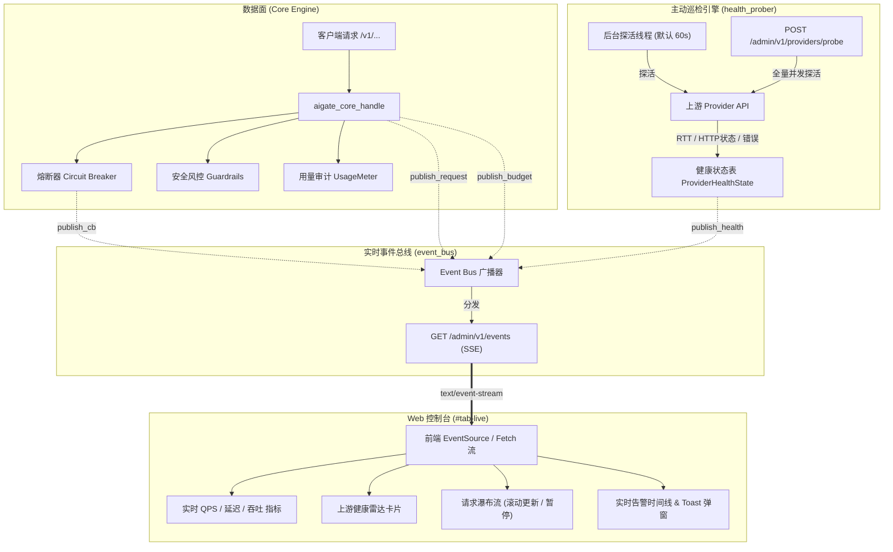

# 网关实时事件流监控室与上游健康主动巡检设计规范

日期：2026-09-27 · 模块：核心服务 (`src/`)、传输层 (`transport_civetweb`)、Web 控制台 (`web/admin.html`) · 状态：设计完成待实现

---

## 1. 目标与背景

### 1.1 背景
当前 `aigate` 网关已具备完善的路由、负载均衡、熔断器、每请求审计明细、成本核算、Redis 集群限流以及安全风控规则管理能力。然而，在实际生产运维场景中仍存在两大关键短板：
1. **上游健康状态被动感知**：目前对 Provider 的可用性判断主要依赖真实流量打在熔断器上踩坑，或管理员在控制台单次手动触发 `POST /admin/v1/providers/:id/test`。缺乏后台自主周期性探活巡检与全量批量探测机制，无法在上游欠费、凭证失效、网络劣化或故障时提前告警。
2. **控制台缺乏实时动态观测能力**：现有的 Admin UI 均为静态数据呈现，管理员排障或观察业务流向时需要频繁手动点击刷新或切换面板。无法实时观察正在流入网关的请求瀑布流、实时 QPS 波动、毫秒级延迟抖动、熔断器状态迁移以及预算超额警告。

### 1.2 建设目标
1. **上游健康主动巡检引擎 (`src/health_prober.{c,h}`)**：
   - 内建轻量后台巡检线程，按周期（可配置，默认 60s）主动对所有启用 Provider 发起轻量健康探测。
   - 维护多状态健康态矩阵（🟢 HEALTHY, 🟡 DEGRADED, 🔴 DOWN, ⚪ PAUSED），记录 RTT 延迟、连续成败次数及错误摘要。
   - 提供 `GET /admin/v1/providers/health` 与 `POST /admin/v1/providers/probe`（一键全量巡检）接口。
2. **网关实时事件总线 (`src/event_bus.{c,h}`) 与 SSE 端点**：
   - 实现线程安全的发布-订阅事件总线与有界环形队列（Ring Buffer），限制最大并发连接数（8 路），支持慢客户端丢弃最旧数据以防内存泄漏。
   - 暴露 `GET /admin/v1/events`（Server-Sent Events 协议），支持 Bearer Token 或 Query Token 鉴权，支持 15s 保活 Ping。
   - 广播四大核心事件类型：`request`（请求完成）、`circuit_breaker`（熔断状态变迁）、`health_probe`（探活结果与健康态跃迁）、`budget_alert`（预算预警与超额告警）。
3. **Web 控制台动态运维监控室 (`#tab-live`)**：
   - 顶部集成实时连接指示灯（🟢 Live / 🔴 离线 / 🟡 重连中）与实时滚动指标栏（动态 QPS、滑动窗口 P99/P50 延迟、实时 Tok/s、今日拦截数）。
   - **上游健康雷达矩阵**：展示所有 Provider 状态徽章、RTT、可用率与「⚡ 一键全量巡检」按钮。
   - **实时请求瀑布流**：自动滚动显示最近 50 条请求明细，展示 Key、模型、Provider、状态码高亮徽章、耗时、Token、成本、风控处置，支持暂停/恢复与检索。
   - **实时告警时间线与 Toast 提醒**：实时捕获熔断告警、上游宕机与预算报警。
4. **单二进制零依赖交付**：
   - 保持 C17 `-Wall -Wextra -Werror` 标准，无第三方外部库依赖，前端纯原生 HTML5/JS/Tailwind 嵌入交付。

---

## 2. 总体架构与数据流



---

## 3. 详细设计规范

### 3.1 上游健康主动巡检引擎 (`src/health_prober.{c,h}`)

#### 3.1.1 数据结构
```c
typedef enum {
    HEALTH_STATUS_UNKNOWN = 0,
    HEALTH_STATUS_HEALTHY,   /* 🟢 RTT < 2000ms, HTTP 200, 连续成功 */
    HEALTH_STATUS_DEGRADED,  /* 🟡 RTT >= 2000ms, 或偶发抖动 */
    HEALTH_STATUS_DOWN,      /* 🔴 连续失败 >= 2, 401, 429, 5xx, 超时 */
    HEALTH_STATUS_PAUSED     /* ⚪ 未启用或未配置 key */
} health_status_t;

typedef struct {
    char            provider_name[32];
    char            endpoint[512];
    health_status_t status;
    long            latency_ms;
    int             last_http_status;
    time_t          last_check_ts;
    int             consecutive_failures;
    int             consecutive_successes;
    char            last_error[256];
} provider_health_t;

typedef struct health_prober {
    pthread_mutex_t   lock;
    pthread_cond_t    cond;
    pthread_t         thread;
    int               running;
    int               interval_sec; /* 默认 60 */
    pg_ops_t          ops;
    void*             ops_ctx;
    uint8_t           master_key[32];
    int               have_master_key;
    event_bus_t*      eb;           /* 关联事件总线，用于广播状态变迁 */
    provider_health_t providers[32];
    int               n_providers;
} health_prober_t;
```

#### 3.1.2 巡检逻辑与判定规则
1. **探活请求**：调用 `upstream_probe(endpoint, upstream_key, 5000, &status, &lat_ns)`。
2. **状态判定**：
   - 若 `status == 200`：
     - 若 `latency_ms >= 2000`：判定为 `HEALTH_STATUS_DEGRADED`（延迟过高预警）。
     - 否则：判定为 `HEALTH_STATUS_HEALTHY`。
     - `consecutive_failures` 清零，`consecutive_successes` 累加。
   - 若 `status != 200`（包含超时、401、429、500、502 等）：
     - `consecutive_failures` 累加，`consecutive_successes` 清零。
     - 若 `consecutive_failures >= 2` 或直接为 `401 / 403`：判定为 `HEALTH_STATUS_DOWN`。
     - 记录格式化错误原因（如 `"HTTP 401: Unauthorized (Invalid Key)"` 或 `"Connection timed out"`）。
3. **事件触发**：若前后状态发生跃迁（如 `HEALTHY` $\to$ `DOWN`），立即通过 `event_bus_publish_health(...)` 发送通知。

---

### 3.2 实时事件流总线 (`src/event_bus.{c,h}`)

#### 3.2.1 架构与并发安全
1. **多路复用订阅池**：
   - 最多支持 `MAX_EVENT_SUBSCRIBERS = 8` 个并发 Admin 订阅者。
   - 每个订阅者拥有一个有界环形队列（容量 64 个事件）。
   - 当订阅者消费过慢时，丢弃其最旧的普通事件（不丢弃重要的熔断和告警事件），并记录丢弃计数。
2. **保活心跳**：
   - 若 15 秒内无业务事件到达，向客户端输出 `: ping\n\n`，保证 TCP 连接不被代理网关切断。
3. **断开检测与优雅注销**：
   - 在 `transport_civetweb.c` 的循环中，每次调用 `mg_write`，若返回 `< 0`（对端断开），立即注销订阅者并释放资源。

#### 3.2.2 事件类型与 JSON 格式

| 事件名 (`event:`) | 触发场景 | 数据载荷示例 (`data:`) |
| :--- | :--- | :--- |
| `request` | 每次数据面请求结束 | `{"ts":1758999999,"key_id":3,"key_name":"dev","model":"gpt-4o","provider":"openai","status":200,"latency_ms":312,"prompt_tokens":100,"completion_tokens":40,"cost":0.0003,"guardrail":"none"}` |
| `circuit_breaker` | 熔断器状态迁移 | `{"ts":1758999999,"provider":"deepseek","model":"deepseek-v3","old_state":"CLOSED","new_state":"OPEN","reason":"Consecutive 5xx errors"}` |
| `health_probe` | 探活完成或状态变更 | `{"ts":1758999999,"provider":"anthropic","status":"HEALTHY","latency_ms":180,"http_status":200,"error":""}` |
| `budget_alert` | 预算用量触碰警戒线 | `{"ts":1758999999,"type":"key","id":2,"name":"team-ai","percent":82.5,"current_usd":82.5,"budget_usd":100.0}` |
| `ping` | 15s 定时心跳 | `{"ts":1758999999}` |

---

### 3.3 Admin REST API 扩充

1. `GET /admin/v1/providers/health`
   - 响应格式：
     ```json
     {
       "providers": [
         {
           "name": "openai",
           "endpoint": "https://api.openai.com/v1",
           "status": "HEALTHY",
           "latency_ms": 235,
           "last_http_status": 200,
           "last_check_ts": 1758999900,
           "consecutive_failures": 0,
           "error": null
         }
       ],
       "checked_at": 1758999900
     }
     ```
2. `POST /admin/v1/providers/probe`
   - 立即同步/异步触发全量探活巡检，并返回最新的健康结果数组。
3. `GET /admin/v1/events`
   - `Content-Type: text/event-stream`，长轮询持久连接。

---

### 3.4 Admin 控制台 `#tab-live` 界面设计

1. **常驻连接状态指示灯（顶栏与侧边栏）**
   - 🟢 `● 实时流已连接 (Live)`（呼吸灯微动效）
   - 🔴 `○ 连接已断开 (点击重连)`
   - 🟡 `○ 正在重连...`
2. **实时指标雷达卡片**
   - **动态实时 QPS**：最近 5 秒请求滑动窗口计数 / 5.0。
   - **实时 P99 / 平均延迟**：最近 30 条请求的 RTT 分布。
   - **实时 Token 速率**：最近 5 秒生成的 Tokens / 5.0 (Tok/s)。
   - **今日风控处置总计**：阻断与脱敏的累计计数。
3. **🏢 上游供应商健康矩阵 (Health Radar Matrix)**
   - 卡片网格展示每一个 Provider：
     - 供应商名称 + 图标徽章（OpenAI / Anthropic / Gemini / DeepSeek 等）。
     - 状态彩标（🟢 正常 / 🟡 降级 / 🔴 异常 / ⚪ 离线）与 RTT 耗时。
     - 最后探活时间（如“12秒前”）。
     - 右上角单节点「🔍 测试」按钮与顶部「⚡ 一键全量巡检 (Probe All)」大按钮。
4. **🌊 实时请求瀑布流 (Live Request Waterfall)**
   - 类似 Wireshark / Network 抓包界面的滚动表格，展示最新 50 条请求：
     - 时间、Key 标识、Model、Provider、状态码 Badge（200 绿、429 橙、5xx 红）、延迟耗时（ms）、Token 总量、费用 ($)、风控动作（🛑 拦截 / 🛡️ 脱敏 / 正常）。
   - 提供「⏸️ 暂停流 / ▶️ 继续流」开关与「模型/Key 过滤输入框」。
   - 点击任意行即可弹出模态框展示请求 JSON 详情。
5. **⚠️ 系统告警动态时间线 (Live Alert Ticker)**
   - 接收熔断器跳闸、上游宕机、预算超限报警，在右上角弹出浮动 Toast，并在右侧小栏保留历史时间线。

---

## 4. 交付与验证标准

1. **C 单元测试套件**：
   - `test_event_bus.c`：验证订阅注册、注销、并发发布、环形队列溢出淘汰、心跳 Ping 与多订阅者隔离。
   - `test_health_prober.c`：验证主动探活逻辑、正常/降级/宕机状态判定、超时处理与事件派发。
   - 全量 `ctest --test-dir .build -R unit` 100% 通过。
2. **Python E2E 集成测试套件**：
   - 在 `tests/integration/test_gateway.py` 中新增：
     - `test_admin_events_sse_stream`：通过 HTTP 客户端建立 SSE 流，发起数据面请求，断言接收到 `event: request` JSON 载荷与 `ping` 事件。
     - `test_provider_health_probe_endpoints`：测试 `GET /admin/v1/providers/health` 与 `POST /admin/v1/providers/probe`，验证探活结果与 RTT 准确性。
   - 全量 `pytest tests/integration/test_gateway.py -v` 全部通过。
3. **编译标准**：
   - C17 标准 `-Wall -Wextra -Werror` 零编译告警。
   - 前端内嵌至 `admin_ui_html.h`，无外部运行时资源依赖。
