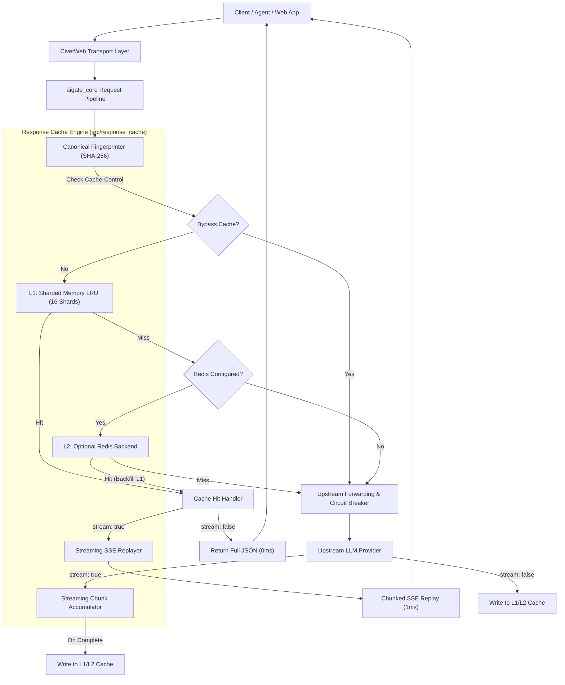

# 高性能响应缓存引擎设计说明书 (Exact Response & Streaming Cache Engine Design)

## 1. 概述与目标 (Overview & Goals)

在现代大语言模型 (LLM) 网关的高频生产环境中，大量请求（如热门 FAQ 问答、相似系统提示词的 Agent 循环、批量数据萃取与分类、代码重试等）存在高度重复。重复向上游供应商发起推理不仅会产生昂贵的 Token 成本，还会带来数百毫秒甚至数十秒的等待延迟。

本设计旨在为 `aigate` 网关构建一套**高性能、分层架构、流式与非流式双向贯通的响应缓存引擎**：
1. **纳秒级命中与零外部依赖**：默认基于 C17 原生分段锁哈希表（16 Shards）与双向链表 LRU，在多线程高并发下消除锁争用，维持单二进制轻量优势；
2. **渐进式分布式共享 (Optional Redis)**：支持配置 `AIGATE_REDIS_URL`，在多网关实例集群部署时实现分布式缓存共享；
3. **规范化精准匹配 (Canonical Fingerprinting)**：智能标准化提取请求关键字段（Model、Messages、System Prompt、Tools、Temperature 等）并生成 SHA-256 指纹，屏蔽格式、空白或键次序微小差异，支持客户端 `Cache-Control: no-cache` 绕过；
4. **流式与非流式全双向互通 (Streaming SSE Dual-Pipeline)**：流式请求未命中透传时后台无阻塞异步组装完整响应入库；流式请求命中时平滑按 SSE 事件块回放输出，流式与非流式请求共享底层同一缓存条目；
5. **深度可观测性与管控**：响应头注入 `X-Cache: HIT/MISS`、Admin API 暴露缓存统计与清空操作、运维全景大屏与实时瀑布流高亮展示缓存命中与 0ms 延迟。

---

## 2. 总体架构图 (Architecture Overview)



---

## 3. 核心数据结构与内存管理 (Core Data Structures)

位于 `src/response_cache.{c,h}`：

### 3.1 单个缓存条目 (`cache_entry_t`)
```c
typedef struct cache_entry {
    char                cache_key[65];     /* 64 字节十六进制 SHA-256 + '\0' */
    char                model[64];         /* 请求的模型名称 */
    char*               response_body;     /* 缓存的完整 JSON 响应报文 (堆分配) */
    size_t              response_len;      /* 响应字节数 */
    int                 status_code;       /* HTTP 响应码 (一般为 200) */
    long                prompt_tokens;     /* 记录节约的 prompt tokens */
    long                completion_tokens; /* 记录节约的 completion tokens */
    double              cost_usd;          /* 记录节约的理论费用 (美元) */
    time_t              created_at;        /* 写入时间戳 */
    time_t              expires_at;        /* 过期时间戳 (created_at + ttl) */

    struct cache_entry* hnext;             /* 分片内哈希桶冲突链表 */
    struct cache_entry* prev;              /* LRU 双向链表前驱 */
    struct cache_entry* next;              /* LRU 双向链表后继 */
} cache_entry_t;
```

### 3.2 分段锁哈希分片 (`cache_shard_t`)
```c
#define CACHE_SHARDS_COUNT 16
#define CACHE_BUCKETS_PER_SHARD 1024

typedef struct {
    pthread_mutex_t     lock;
    cache_entry_t*      buckets[CACHE_BUCKETS_PER_SHARD];
    cache_entry_t*      lru_head;          /* 最近使用节点 (MRU) */
    cache_entry_t*      lru_tail;          /* 最久未用节点 (LRU，优先淘汰) */
    size_t              count;             /* 当前条目计数 */
    size_t              bytes_used;        /* 当前占用堆内存字节数 */
    size_t              max_count;         /* 单分片最大条目数配额 */
    size_t              max_bytes;         /* 单分片最大内存字节配额 */
    uint64_t            hits;              /* 分片命中计数 */
    uint64_t            misses;            /* 分片未命中计数 */
} cache_shard_t;
```

### 3.3 缓存管理器句柄 (`response_cache_t`)
```c
typedef struct response_cache {
    cache_shard_t       shards[CACHE_SHARDS_COUNT];
    int                 enabled;
    long                default_ttl_sec;   /* 默认 3600 秒 */
    size_t              total_max_bytes;   /* 默认 128 MB */
    size_t              total_max_entries; /* 默认 20,000 条 */
    
    /* 可选外部 Redis 连接上下文 */
    int                 redis_enabled;
    char                redis_host[128];
    int                 redis_port;
    char                redis_auth[128];

    /* 全局统计原子累加器 */
    _Atomic uint64_t    total_saved_prompt_tokens;
    _Atomic uint64_t    total_saved_completion_tokens;
    _Atomic double      total_saved_cost_usd;
} response_cache_t;
```

### 3.4 淘汰与过期回收 (Eviction & Expiration)
1. **分片路由 (Shard Hashing)**：
   计算 `cache_key` 前两位十六进制字符数值对 16 取模，将并发读写均匀分散到 16 把独立的互斥锁上，避免跨线程阻塞。
2. **LRU 淘汰 (Eviction on Write)**：
   在向分片插入新条目时，若 `shard->count >= shard->max_count` 或 `shard->bytes_used + len > shard->max_bytes`，从 `lru_tail` 循环淘汰节点并释放 `response_body` 堆内存，直至满足配额。
3. **延迟过期与主动清理 (Passive & Active Eviction)**：
   - 读命中时检查 `time(NULL) >= entry->expires_at`，若超时则立即在分片锁内解挂、释放并视作 Cache Miss；
   - 守护线程每 60 秒轮询扫除超期条目，避免冷门孤儿条目占用内存。

---

## 4. 规范化请求指纹算法 (Canonical Fingerprinting)

### 4.1 提取与规范化逻辑
无论是 OpenAI `/v1/chat/completions`、Anthropic `/v1/messages` 还是 Gemini 格式，统一规范为标准序列化字符串：
1. **Model**：转为小写字符串（如 `gpt-4o`）。
2. **Messages / Contents**：
   - 遍历各轮消息，提取 `role` 与 `content`；
   - 若 content 为多部件数组（如图片+文字），仅对文字部分作归一化，图片计算 base64/URL 摘要；
   - 忽略前端自定义的 message id、timestamp 等无用元数据。
3. **System Prompt**：统一提前抽取并作为独立字段。
4. **Tools / Functions**：按工具名称字典序排序，拼接工具描述与入参模式签名。
5. **采样超参数**：提取 `temperature`（格式化为两位小数 `%.2f`）与 `top_p`（若存在）。

### 4.2 摘要生成公式
格式化模板：
`model:<m>|temp:<t>|topp:<p>|sys:<s>|msgs:<role1>:<content1>|<role2>:<content2>|tools:<tool1>,<tool2>`

通过 OpenSSL `SHA256()` 计算其哈希，生成 64 位纯小写十六进制字符串。

### 4.3 客户端绕过控制 (Bypass Headers)
- 若请求携带 `Cache-Control: no-cache`、`Cache-Control: max-age=0` 或 `X-Skip-Cache: true`，跳过缓存读取直接转发上游；
- 若请求携带 `Cache-Control: no-store`，跳过缓存读取，且上游成功返回后亦不写入缓存。

---

## 5. 流式 (SSE) 与非流式双向贯通流水线

### 5.1 统一存储形态
无论请求最初以流式还是非流式发起，缓存内部统一存储该次交互的**完整标准化响应 JSON**，例如：
```json
{
  "id": "chatcmpl-cache-123456",
  "object": "chat.completion",
  "created": 1727435400,
  "model": "gpt-4o",
  "choices": [
    {
      "index": 0,
      "message": {
        "role": "assistant",
        "content": "Hello! I am a cached response."
      },
      "finish_reason": "stop"
    }
  ],
  "usage": {
    "prompt_tokens": 15,
    "completion_tokens": 8,
    "total_tokens": 23
  }
}
```

### 5.2 流式请求命中回放 (Streaming Cache Replay)
当客户端发起 `stream: true` 并命中缓存时：
1. 发送 HTTP 200 与分块传输头：
   ```http
   HTTP/1.1 200 OK\r\n
   Content-Type: text/event-stream\r\n
   Cache-Control: no-cache\r\n
   Transfer-Encoding: chunked\r\n
   X-Cache: HIT\r\n
   X-Cache-Lookup-Time: 0.12ms\r\n\r\n
   ```
2. 解析缓存中的 `choices[0].message.content` 文本；
3. **平滑回放分块器**：
   - 将文本拆分成适合前端渲染的字符块（如以标点、换行或固定 32 字符步长分块）；
   - 对每个块封装为 OpenAI 兼容的流事件结构：
     `data: {"id":"chatcmpl-cache-...","choices":[{"index":0,"delta":{"content":"..."}}]}\n\n`
   - 通过 `mg_send_chunk` 高速推送；
   - 发送携带真实 `usage` 的流结束事件以及 `data: [DONE]\n\n`；
   - 发送零长度 chunk `mg_send_chunk(conn, "", 0)` 完成流式关闭。

### 5.3 流式请求透传与异步组装 (Streaming Cache Accumulator)
当客户端发起 `stream: true` 且未命中缓存时：
1. 网关将上游的每一个 SSE chunk 原样即时推送给客户端（零缓冲、零增加 TTFT 延迟）；
2. 内部上下文分配 `streaming_cache_accumulator_t`（最大上限 512KB 动态堆内存）：
   - 提取流式 chunk 中的 `delta.content`，追加拼接至缓冲区；
   - 提取最后的 `usage` 与 `finish_reason`；
3. 上游流式正常结束且客户端断开前，在线程内构造完整响应 JSON，异步调用 `response_cache_set` 写入 L1 内存分片（及可选的 L2 Redis）；
4. 若流中途出错、上游报 5xx 或客户端中途断开，放弃入库，确保缓存数据的绝对完整性与纯净度。

---

## 6. 管理端点与控制台集成 (Admin API & Web UI)

### 6.1 管理 API
1. **`GET /admin/v1/cache/stats`**：
   - 响应包含：缓存启用状态、当前后端（`sharded_lru` / `sharded_lru+redis`）、分片数、当前条目数、最大条目数配额、已使用内存字节、内存上限、累计命中数、累计未命中数、命中率百分比、累计节约 Prompt/Completion Tokens、累计节约美元费用。
2. **`POST /admin/v1/cache/purge`**：
   - 请求体可选：`{ "model": "gpt-4o" }` 或 `{}`（清空全量）；
   - 响应：`{ "purged_entries": 420, "freed_bytes": 4518290, "model": "all" }`。

### 6.2 实时运维大屏 (`#tab-live`) 联动
1. **KPI 指标卡**：
   - 增加「⚡ 缓存命中率」动态卡片，显示当前实时命中率与节约成本。
2. **实时请求瀑布流 (Live Request Waterfall)**：
   - 命中缓存的行以醒目的绿色 `[CACHE HIT]` 徽章标记；
   - 耗时显示为 `0ms` 或 `<1ms`，上游提供商显示为 `cache`；
   - 点击该行弹出详情 Modal，展示 `Cache Key: 8f4a...`、`Cached Age: 45s`、`Saved Cost: $0.0032`。
3. **事件总线 (`event_bus`)**：
   - 缓存命中时向总线广播 `EVENT_REQUEST`，payload 包含 `cached: true` 与 `latency_ms: 0`；
   - 执行 Purge 时广播 `EVENT_HEALTH_PROBE` 或 `cache_purge`，大屏时间线同步滚动显示。

---

## 7. 错误处理与防御性边界 (Error Handling & Edge Cases)

1. **内存超限保护**：分片内存硬上限由 `total_max_bytes / 16` 严格钳位，`malloc` 失败时安全降级跳过写入，不影响正常数据面请求。
2. **极大请求/响应熔断**：单条响应若超过 1 MB，放弃入缓存（避免大文件污染内存池）。
3. **并发安全与死锁预防**：哈希分片锁之间相互独立，任何操作严格只锁住所属的一个分片，绝不产生跨分片嵌套加锁。
4. **单二进制平滑降级**：若未配置 Redis 或 Redis 网络瞬断，自动静默降级为纯本地内存分片 LRU，零报错中断。

---

## 8. 自动化测试策略 (Test Strategy)

1. **C 单元测试 (`tests/unit/test_response_cache.c`)**：
   - 验证分片哈希分配与规范化 SHA-256 指纹生成的一致性；
   - 验证 LRU 淘汰：插入超过容量上限条目，断言最旧条目被逐出；
   - 验证 TTL 过期：条目超时后查询返回 NULL 并释放内存；
   - 验证多线程并发读写：16 线程高并发存取，Valgrind / AddressSanitizer 验证零内存泄漏与数据竞争；
   - 验证 Purge 功能（按模型清空与全量清空）。
2. **Python 集成测试 (`tests/integration/test_gateway.py`)**：
   - `test_response_cache_exact_hit`: 发送相同请求，第 1 次未命中（`X-Cache: MISS`），第 2 次直接命中（`X-Cache: HIT`，上游 Mock 无新增请求）；
   - `test_response_cache_bypass`: 携带 `Cache-Control: no-cache`，验证即使有缓存也穿透请求；
   - `test_response_cache_streaming_dual_replay`: 非流式请求写入缓存后，以 `stream: true` 发起相同请求，验证客户端成功收到平滑 SSE 流和 `[DONE]`；
   - `test_admin_cache_stats_and_purge`: 验证 `/admin/v1/cache/stats` 统计数据正确，执行 `/admin/v1/cache/purge` 后缓存被彻底清空。
