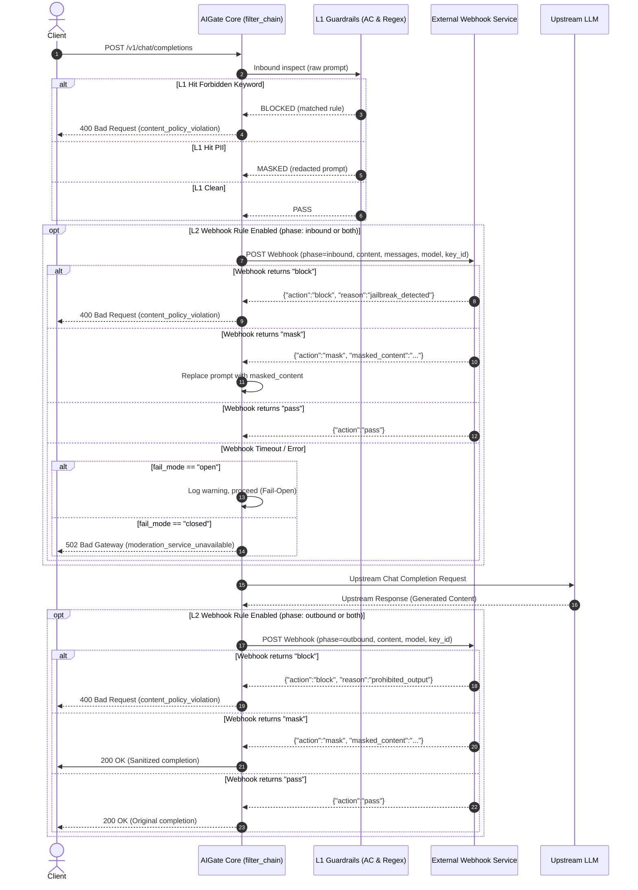

# Design Specification: Tiered Hybrid Guardrails with External Webhook Moderation Plugin

**Date:** 2026-10-01  
**Status:** In Review  
**Target Files:**  
- `src/store/schema_sql.h`, `src/store/pg_store.h`, `src/store/pg_store.c`  
- `src/policy/guardrails.h`, `src/policy/guardrails.c`  
- `src/policy/filter_chain.h`, `src/policy/filter_chain.c`  
- `src/core/aigate_core.c`  
- `src/server/admin_api.c`  
- `web/admin.html`  
- `tests/integration/test_guardrails_webhook.py`  

---

## 1. Overview & Objectives

AIGate currently provides Layer-1 local content moderation via:
1. **Aho-Corasick multi-keyword automaton** for instantaneous forbidden keyword matching.
2. **Regex-based PII redaction** (Email, Phone, API Key, National ID).

While L1 matching provides sub-millisecond local latency, enterprise deployments require **deep content moderation** that evaluates nuanced semantics, prompt jailbreak attempts, code vulnerabilities, and context-dependent toxicity through dedicated internal or third-party moderation services (e.g. enterprise AI security gateways, Baidu AI Moderation, NetEase Yidun, or custom Python microservices).

This specification designs a **Tiered Hybrid Moderation Architecture**:
- **Layer 1 (L1 Local Fast-Path):** AC keyword blacklist and regex PII masking (< 0.1ms). If violated, block or mask immediately without network egress.
- **Layer 2 (L2 Deep Moderation via Webhook Plugin):** If L1 passes, dynamically invokes configured external HTTP Webhook endpoint(s) with structured payloads, configurable timeouts, bidirectional (inbound/outbound) inspection, and flexible failure degradation policies (`fail-open` vs `fail-closed`).

---

## 2. Architecture & Data Flow



---

## 3. Webhook Protocol Specification

### 3.1 Request Payload (Gateway -> Webhook)
Sent as `POST` with `Content-Type: application/json` and optional `Authorization: Bearer <webhook_secret>`:

```json
{
  "phase": "inbound",
  "model": "gpt-4o",
  "key_id": 1024,
  "content": "Hello, how can I configure a reverse proxy?",
  "messages": [
    { "role": "system", "content": "You are a helpful assistant." },
    { "role": "user", "content": "Hello, how can I configure a reverse proxy?" }
  ],
  "timestamp": 1727778900
}
```

- `phase`: `"inbound"` (user prompt) or `"outbound"` (model completion).
- `model`: Target routed LLM model name.
- `key_id`: Client API key ID.
- `content`: Plain extracted text string for quick inspection.
- `messages`: Complete conversation array for deep contextual moderation.
- `timestamp`: Epoch seconds.

### 3.2 Expected Response Payload (Webhook -> Gateway)
HTTP Status 200 with JSON:

```json
{
  "action": "pass",
  "reason": "",
  "masked_content": ""
}
```
- `action`:
  - `"pass"`: Content approved, continue pipeline.
  - `"block"`: Content violates policy. Gateway immediately aborts request with HTTP 400.
  - `"mask"`: Content modified. Gateway replaces the content with `masked_content` and continues.
- `reason`: Optional human-readable description of violation (e.g. `"prompt_injection"`, `"toxic_content"`).
- `masked_content`: Required when `action == "mask"`.

---

## 4. Database Schema & Migration v11

Extend table `guardrails_rules` to store webhook parameters:

```sql
-- Migration v11: external webhook moderation plugin support
ALTER TABLE guardrails_rules
  ADD COLUMN IF NOT EXISTS webhook_secret TEXT DEFAULT NULL,
  ADD COLUMN IF NOT EXISTS timeout_ms INT NOT NULL DEFAULT 500,
  ADD COLUMN IF NOT EXISTS fail_mode VARCHAR(16) NOT NULL DEFAULT 'open',
  ADD COLUMN IF NOT EXISTS phase VARCHAR(16) NOT NULL DEFAULT 'inbound';

INSERT INTO schema_migrations(version) VALUES (11) ON CONFLICT (version) DO NOTHING;
```

### Struct Updates (`src/store/pg_store.h`)
```c
typedef struct guardrail_rule {
    long   id;                     /**< Primary key */
    char   rule_type[32];          /**< "keyword" | "regex" | "pii" | "webhook" */
    char   pattern[512];           /**< URL for webhook, or keyword pattern */
    char   action[32];             /**< "block" | "mask" */
    char   category[64];           /**< "general" | "security" etc. */
    int    enabled;                /**< 1 = true, 0 = false */
    char   webhook_secret[256];    /**< Optional Bearer token */
    int    timeout_ms;             /**< Webhook HTTP timeout in ms (default: 500) */
    char   fail_mode[16];          /**< "open" (fail-open) | "closed" (fail-closed) */
    char   phase[16];              /**< "inbound" | "outbound" | "both" */
    time_t created_at;             /**< Creation timestamp */
} guardrail_rule_t;
```

---

## 5. Policy Engine & Filter Chain Implementation

### 5.1 Guardrails Engine (`src/policy/guardrails.h`, `guardrails.c`)
- Add Webhook rule cache structure:
  ```c
  typedef struct guardrail_webhook_rule {
      long id;
      char url[512];
      char secret[256];
      int  timeout_ms;
      char fail_mode[16];
      char phase[16];
  } guardrail_webhook_rule_t;
  ```
- Store active webhook rules in `guardrails_ctx_t`.
- Implement `guardrails_inspect_webhook()`:
  - Uses `curl_easy_init()` (reusing curl share pool) or a dedicated perform helper.
  - Formats JSON payload containing `phase`, `model`, `key_id`, `content`, `messages`.
  - Parses response JSON using `jansson`.
  - Evaluates action: `GUARDRAILS_PASS`, `GUARDRAILS_MASKED`, `GUARDRAILS_BLOCKED`.
  - In case of timeout or connection failure:
    - If `fail_mode == "closed"` -> returns `GUARDRAILS_BLOCKED` with reason `"moderation_timeout"`.
    - If `fail_mode == "open"` -> logs warning and returns `GUARDRAILS_PASS`.

### 5.2 Filter Chain Integration (`src/policy/filter_chain.c`)
- **Inbound Filter (`filter_guardrails`)**:
  - Runs L1 (keyword AC trie + PII regex).
  - If L1 returns `GUARDRAILS_BLOCKED` -> stops immediately.
  - If L1 passes (or masks), calls L2 webhook moderation for all active webhook rules with `phase == "inbound"` or `"both"`.
- **Outbound Filter**:
  - Expose `filter_chain_execute_outbound(chat_req_t* q, const char* resp_body, size_t resp_len, char** out_body, size_t* out_len)`.
  - Inspects non-streaming completions when active webhook rules have `phase == "outbound"` or `"both"`.

---

## 6. Admin API & Web UI Extensions

### 6.1 Admin API (`src/server/admin_api.c`)
- Allow `rule_type == "webhook"`.
- Validate `pattern` as valid HTTP/HTTPS URL when `rule_type == "webhook"`.
- Support new fields in POST/PUT: `webhook_secret`, `timeout_ms`, `fail_mode`, `phase`.
- Add test endpoint `POST /admin/v1/guardrails/webhook/test`:
  - Payload: `{"url": "...", "webhook_secret": "...", "timeout_ms": 1000}`
  - Performs instant test probe, returns `{"status": "ok", "latency_ms": 12.4, "response": {...}}` or error message.

### 6.2 Admin Web UI (`web/admin.html`)
- In "🛡️ 安全风控" panel:
  - Rule creation modal: When `rule_type == "webhook"`, shows dynamic fields:
    - Webhook URL (`pattern`).
    - 认证令牌 (Webhook Secret / Bearer Token).
    - 超时时间 (毫秒, default 500ms).
    - 降级策略 (Fail-Open 放行 / Fail-Closed 阻断).
    - 审查阶段 (入站 Prompt / 出站 Response / 双向 Both).
  - Webhook Card / Badge: Display distinct `🌐 Webhook` badge in rules table.
  - Test Connection Button: Instant test probe feedback modal.

---

## 7. Verification & Testing Plan

1. **Unit Tests (`src/policy/guardrails.c`)**:
   - Webhook payload serialization and response deserialization test.
   - Fail-Open vs Fail-Closed error behavior test.
2. **Integration Tests (`tests/integration/test_guardrails_webhook.py`)**:
   - Mock moderation webhook server with endpoints:
     - `/mock/moderate/pass`: returns `{"action":"pass"}`.
     - `/mock/moderate/block`: returns `{"action":"block", "reason":"illegal_content"}`.
     - `/mock/moderate/mask`: returns `{"action":"mask", "masked_content":"[SANITIZED]"}`.
     - `/mock/moderate/slow`: sleeps 2 seconds to trigger timeout.
   - Test Gateway E2E with mock upstream:
     - Verify inbound prompt blocking.
     - Verify inbound prompt masking.
     - Verify timeout with Fail-Open (request succeeds).
     - Verify timeout with Fail-Closed (request blocked with 502/400).
     - Verify Admin API CRUD and Webhook test ping endpoint.
